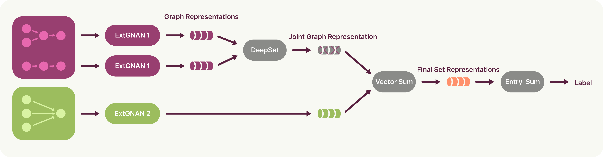

# SuperMAN:  Interpretable And Expressive Networks Over Temporally Sparse Heterogeneous Data

[]([https://your-paper-link-here](https://arxiv.org/pdf/2505.19193))
[](https://opensource.org/licenses/MIT)
[](#)

This repository contains the official implementation of **Super Mixing Additive Networks (SuperMAN)** from the ICLR 2026 paper:

**"SuperMAN:  Interpretable And Expressive Networks Over Temporally Sparse Heterogeneous Data"** ([arXiv:2505.19193](https://arxiv.org/abs/2505.19193))

## Overview

**Super Mixing Additive Networks (SuperMAN)** is an interpretable-by-design graph learning framework for prediction tasks over sets of temporally sparse, irregular signals—such as blood test trajectories or social media cascades. SuperMAN represents each temporal trajectory as a directed graph and processes sets of such graphs using a flexible architecture that balances expressivity and interpretability. It extends Graph Neural Additive Networks (GNAN) by allowing both univariate and multivariate feature modeling, subset-level aggregation, and multi-scale attribution (node, graph, and group). SuperMAN achieves state-of-the-art performance on high-stakes medical tasks, including Crohn’s Disease diagnosis and ICU mortality prediction, while also generalizing to domains like fake news detection. Its design enables precise attribution of predictions to individual signals and time points, supporting real-world decision-making with transparent, trustworthy insights.

### Architecture

<div align="center">

</div>

The SuperMAN architecture consists of:

1. **Input Processing**: Heterogenuous temporal sparse data is organized into groups based on priors
2. **Extended Graph Neural Additive Networks (EXTGNANs)**: Each group is processed by a separate ExtGNAN that learn node and graph representations
3. **Mixing Layer**: A DeepSet-based aggregation mechanism combines outputs from different ExtGNANs
4. **Prediction Head**: Final classification/regression layer


## Installation

1. Clone the repository:
```bash
git clone https://github.com/your-username/Graph-Mixing-Additive-Networks---GMAN.git
cd Graph-Mixing-Additive-Networks---GMAN
```

2. Install dependencies:
```bash
pip install -r requirements.txt
```

## Usage

### Training a Model

The main training script is `main.py`. You need to specify a configuration file that defines the experiment parameters.

#### PhysioNet 2012 Dataset

```bash
python main.py --config_path configs/physionet.yaml
```

#### FakeNews Dataset

```bash
python main.py --config_path configs/fakenews.yaml
```

### Configuration Files

The repository includes pre-configured YAML files for both datasets:

- `configs/physionet.yaml`: Configuration for PhysioNet 2012 mortality prediction
- `configs/fakenews.yaml`: Configuration for fake news detection

You can modify these files or create new ones to experiment with different hyperparameters. Key parameters include:

- `n_layers`: Number of layers in the GNANs
- `hidden_channels`: Hidden dimension size
- `lr`: Learning rate
- `batch_size`: Training batch size
- `epochs`: Number of training epochs
- `gnan_mode`: How to assign GNANs to biomarker groups (`single`, `per_group`, `per_biomarker`)

### Command Line Arguments

You can override any configuration parameter via command line:

```bash
python main.py --config_path configs/physionet.yaml --lr 0.01 --batch_size 64 --epochs 100
```

### Inference and Visualization

The repository includes visualization tools for analyzing model predictions and biomarker importance:

```bash
python inference/P12_inference.py --config_path configs/physionet.yaml
```

This will generate:
- Node importance visualizations
- Biomarker group contribution plots
- Prediction sensitivity analyses

## Project Structure

```
├── configs/                    # Configuration files
│   ├── physionet.yaml         # PhysioNet 2012 config
│   └── fakenews.yaml          # FakeNews config
├── data/                      # Data loading and processing
│   ├── loaders/              # Dataset classes
│   └── collate_fns/          # Batch collation functions
├── model/                     # Model implementations
│   ├── GMAN.py               # Main SuperMAN model
│   ├── GMANFakeNews.py       # FakeNews-specific variant
│   ├── utils.py              # Model utilities
│   └── GMAN_trainer.py       # Training utilities
├── inference/                 # Inference and visualization
│   ├── P12_inference.py      # PhysioNet inference script
│   └── visualisation/        # Plotting utilities
├── img/                      # Paper figures
├── main.py                   # Main training script
├── config.py                 # Configuration management
└── utils.py                  # General utilities
```

## Datasets

### PhysioNet 2012

The PhysioNet Challenge 2012 dataset focuses on mortality prediction in ICU patients. Place your data files in the `P12_data_splits/` directory. The original dataset can be downloaded from https://www.physionet.org/content/challenge-2012/1.0.0/ and should be stored in the root directory as "tmp".

### FakeNews

The FakeNews dataset is used for fake news detection. Place your processed data in the `FakeNewsData/` directory.

## Citation

If you use this code in your research, please cite:

```bibtex
@article{zerio2025interpretable,
  title={Interpretable Graph Learning Over Sets of Temporally-Sparse Data},
  author={Zerio, Andrea and Bechler-Speicher, Maya and Huri, Maor and Vestergaard, Marie Vibeke and Gilad-Bachrach, Ran and Jess, Tine and Bhatt, Samir and Sazonovs, Aleksejs},
  journal={arXiv preprint arXiv:2505.19193},
  year={2025}
}
```


## Contact

For questions, issues or collaboration ideas, please contact [anze@dcm.aau.dk].
